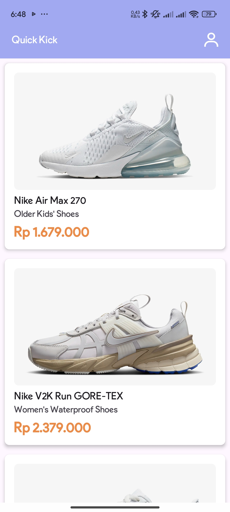
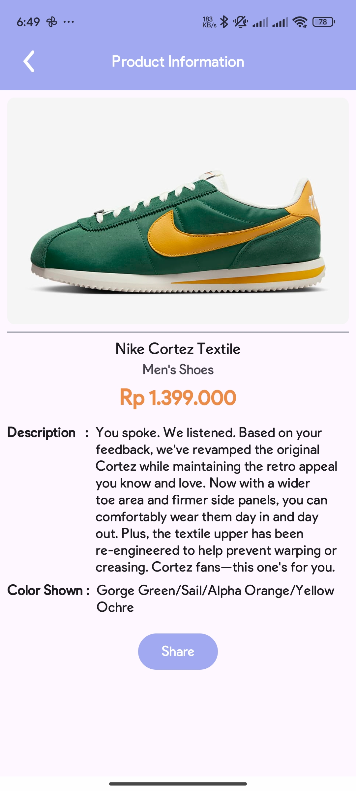
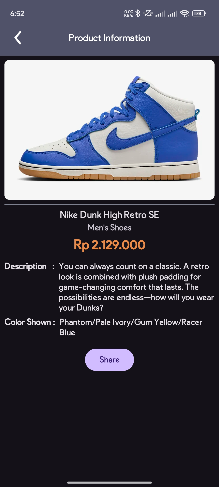
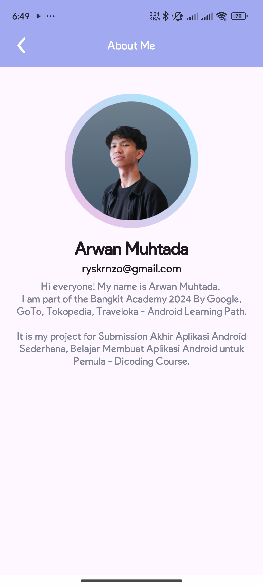
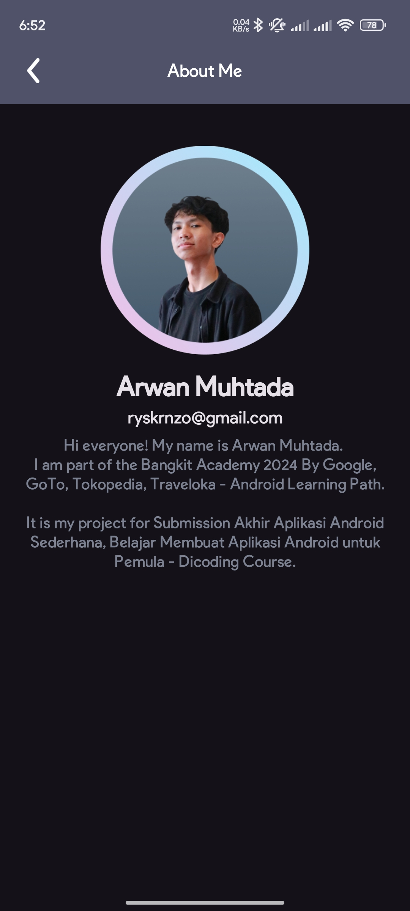
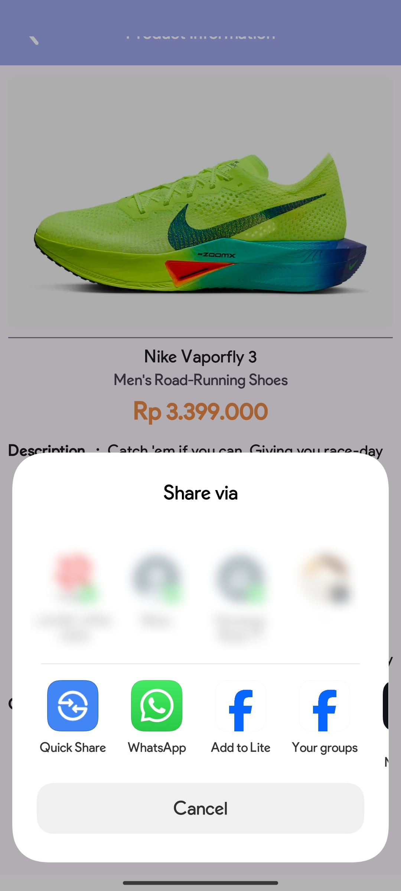
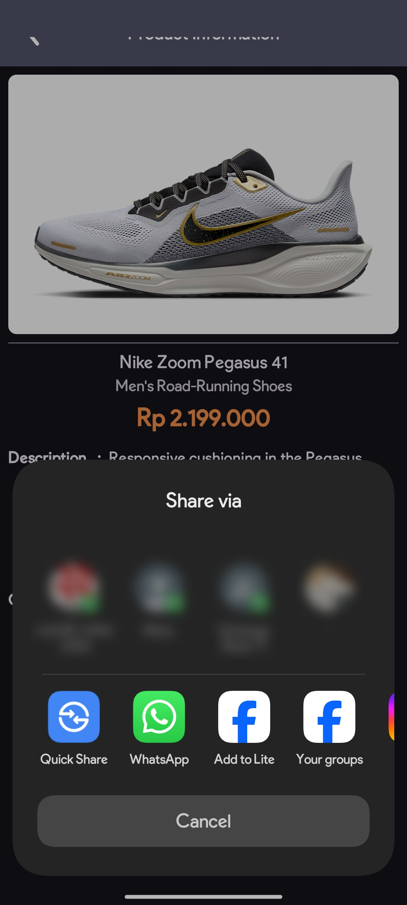
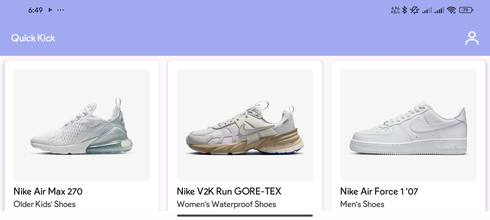
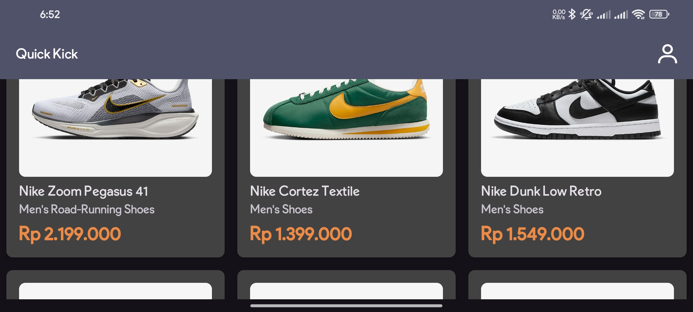
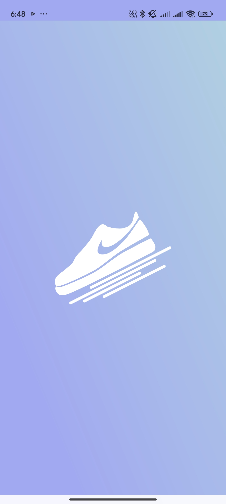

# Quick Kick - Submission Akhir Aplikasi Android Sederhana

## Screenshots

### Main Screens

#### Main Activity



#### Detail Activity



#### About Page



#### Share Page



#### Landscape Mode



#### Splash Activity


## Installation and Setup

Clone the repository:
   ```bash
   git clone https://github.com/wanmuhtd/QuickKick-Submission-Akhir-Aplikasi-Android-Sederhana.git
